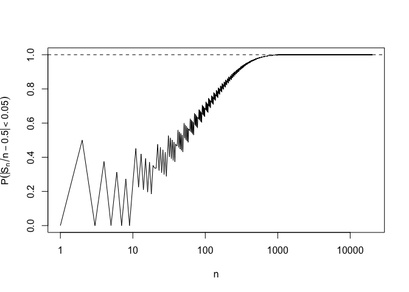
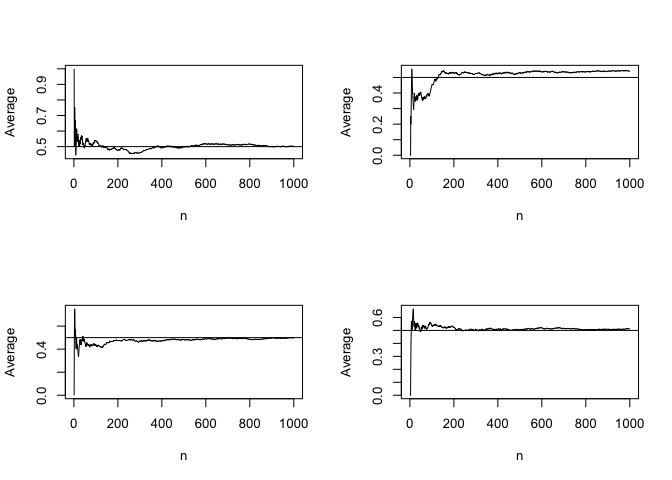
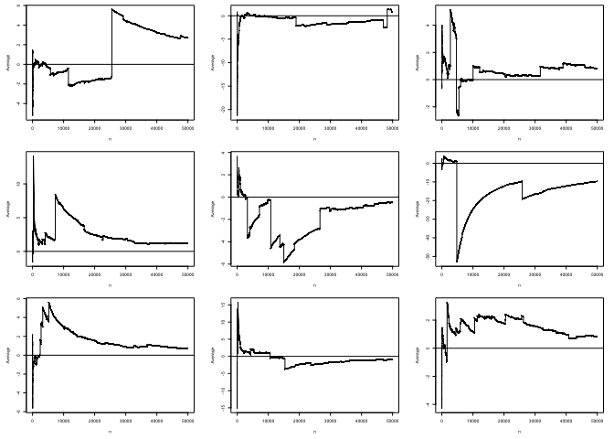

Probability
================
Zhengyuan Gao
9/30/2017

Weak Law of Large Numbers
=========================

Consider *S*<sub>*n*</sub> = *X*<sub>1</sub> + ⋯ + *X*<sub>*n*</sub> as the sum of a series of binomial distributed variables with parameters *n* and *μ* = 1/2. The probability
lim<sub>*n* → ∞</sub>Pr(|*S*<sub>*n*</sub>/*n* − *μ*|&lt;*ϵ*)
 is given in the following illustration with *ϵ* = 0.01.

``` r
mu = 1/2
eps = 0.01

wlln= function(n, mu, eps){
  pbinom(n*mu + n*eps, n, mu) - pbinom(n*mu - n*eps, n, mu)
}

st = vector(length=50000)
for (n in 1:50000)
st[n] <- wlln(n, mu, eps)

plot(st,log="x",ylab=expression(P(abs(S[n]/n - 0.5)  < 0.01)  ),main="",xlab="n",type="l")
abline(h=1.0,lty=2)
```



Strong Law of Large Number
==========================

The statement is about the set $\\left\\{ \\lim\_{n\\rightarrow \\infty} \\frac{S\_n}{n} =\\mu \\right\\}$ is an event on some sample space.
$$ \\Pr \\left\\{ \\lim\_{n\\rightarrow \\infty} \\frac{S\_n}{n} =\\mu \\right\\}= 1 $$
 For a 0 − 1 sequence *ω* ∈ *Ω*, the set $\\left\\{ \\lim\_{n\\rightarrow \\infty} \\frac{S\_n}{n} =\\mu \\right\\}$ is the set of all sequences *ω* with the property that (*ω*<sub>1</sub> + ⋯ + *ω*<sub>*n*</sub>)/*n* → *μ* as *n* → ∞. This set is in fact an event contained in *Ω*. And the strong law of large numbers says that this probability is equal to 1.

The *Weierstrass approximation theorem* says that a continuous function *f* on \[0, 1\] can be approximated arbitrarily closely by polynomials. In particular, for 0 ≤ *p* ≤ 1,
$$
\\sum\_{k=0}^{n}f(\\frac{k}{n})C^{n}\_{k}p^{k}(1-p)^{n-k} \\rightarrow f(p)
$$
 as *n* → ∞. The *n*-th degree polynomial function of *p* on the left-hand side is known as the Bernstein polynomial.

Consider as before *S*<sub>*n*</sub> = *X*<sub>1</sub> + ⋯ + *X*<sub>*n*</sub> as the sum of a series of binomial distributed variables with parameters *n* and *μ* = *p*. By the strong law of large numbers
$$ \\frac{X\_1 +\\cdots + X\_n}{n} \\rightarrow p$$
 with probability 1. As *f* is continuous, then
$$ f\\left( \\frac{X\_1 +\\cdots + X\_n}{n}\\right) \\rightarrow f(p)$$
 and similarly
$$ \\mathbb{E} \\left\[ f\\left( \\frac{X\_1 +\\cdots + X\_n}{n}\\right) \\right\] \\rightarrow \\mathbb{E}\[f(p)\] = f(p).$$
 As
$$ \\mathbb{E} \\left\[ f\\left( \\frac{X\_1 +\\cdots + X\_n}{n}\\right) \\right\] = \\sum\_{k=0}^{n}f(\\frac{k}{n})C^{n}\_{k}p^{k}(1-p)^{n-k}$$
 we prove the Weierstrass approximation theorem.

``` r
par(mfrow=c(2,2))
sllnBern = function(n,p){ 
for (i in 1:4) {
    seq = rbinom(n,1,p)
    avgs = cumsum(seq)/(1:n)
    plot(avgs,type="l",xlab="n",ylab="Average")
    abline(h = p)}
}
  
sllnBern(1000,.5)  
```



Also we can see Cauchy distribution whose expectation does not exist so that SLLN does not apply.

``` r
par(mfrow=c(3,3), mar = c(5,5,1,2), cex=0.3)
sllnCauchy = function(n) {
for (i in 1:9) {
    seq = rcauchy(n)
    avgs = cumsum(seq)/(1:n)
    plot(avgs,type="l",xlab="n",ylab="Average")
    abline(h = 0)
    }
 }
sllnCauchy(50000)
```


